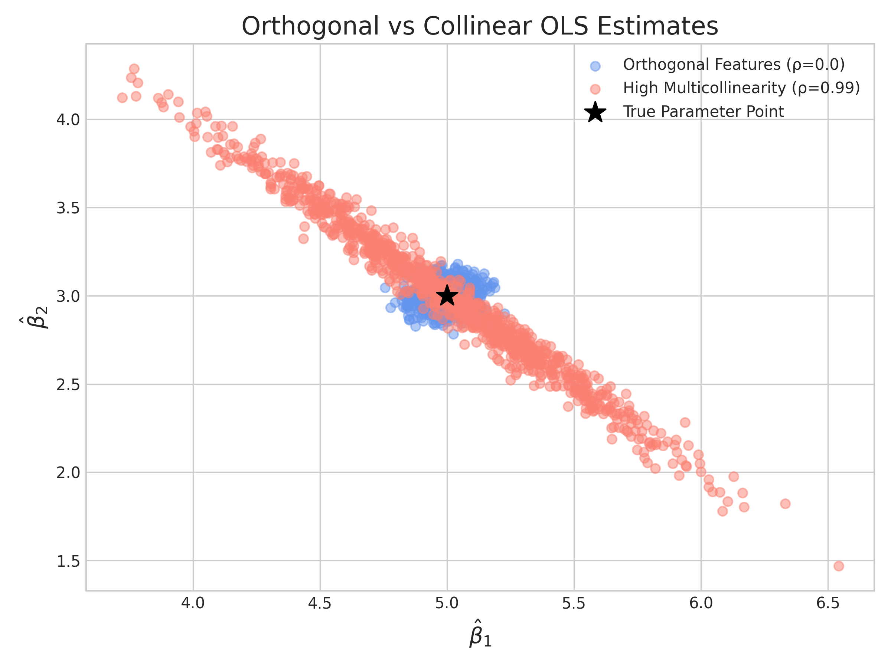

# 第5周实验报告：多重共线性与OLS估计的协方差分析

---

## 一、实验背景与目的
### 1.1 实验背景
在理论课中，我们推导出了OLS估计量的协方差公式：
$$
\text{Var}(\hat{\beta}) = \sigma^2 (X^\top X)^{-1}
$$
本实验通过蒙特卡洛模拟，在代码中直观验证：当特征之间存在严重多重共线性时，该协方差矩阵如何被“撕裂”，估计量的方差如何剧烈放大，以及系数估计值之间为何会出现强负相关关系。

### 1.2 实验目的
1. 构造带指定相关性的特征矩阵，实现不同程度共线性的对比实验。
2. 通过1000次蒙特卡洛模拟，观察并记录OLS系数估计值的分布。
3. 对比**经验协方差矩阵**与**理论协方差矩阵**，验证公式的正确性。
4. 可视化正交与共线性条件下的估计分布差异，并解释其背后的统计学原理。

---

## 二、实验环境与文件结构
### 2.1 实验环境
- **操作系统**: WSL2 (Ubuntu 22.04)
- **编程语言**: Python 3.10+
- **核心依赖**: `numpy`, `matplotlib`
- **开发工具**: VS Code

### 2.2 文件结构
week05/
├── docs/
│ ├── report.md # 本实验报告
│ └── beta_scatter.png # 生成的结果图
└── src/
├── data_generator.py # 构造 DGP
├── simulation.py # 蒙特卡洛模拟与协方差计算
├── analysis.py # 可视化绘图
└── main.py # 主程序入口

---

## 三、实验设计与实现
### 3.1 核心参数设定
- **真实系数**: $\beta = [5.0, 3.0]^\top$
- **噪声标准差**: $\sigma = 2.0$
- **样本量**: $n = 1000$
- **模拟次数**: $1000$ 次
- **对比实验**:
  - **实验A (正交特征)**: 相关系数 $\rho = 0.0$
  - **实验B (高度共线性)**: 相关系数 $\rho = 0.99$

### 3.2 关键实现要点
1. **固定设计矩阵**: 为了保证实验的严谨性，在循环外部只生成一次特征矩阵 $X$，每次模拟仅更新随机噪声 $\epsilon$。
2. **协方差计算**: 使用 `numpy.cov()` 计算1000次估计值的经验协方差，并与公式 $\sigma^2 (X^\top X)^{-1}$ 得到的理论协方差进行对比。

---

## 四、实验结果与分析
### 4.1 系数估计分布散点图

- **正交特征 ($\rho=0.0$)**: 蓝色点集呈现出近似圆形的分布，集中在真实参数点附近，说明估计值方差小，且两个系数之间几乎不存在相关性。
- **高度共线性 ($\rho=0.99$)**: 红色点集呈现出明显的倾斜椭圆分布，且椭圆长轴与短轴差距极大，说明估计值方差被严重放大，且 $\hat{\beta}_1$ 与 $\hat{\beta}_2$ 之间呈现强烈的负相关。

### 4.2 协方差矩阵对比
#### 经验协方差矩阵 (Empirical Covariance Matrix)
[[ 0.1989 -0.1979]
[-0.1979 0.2014]]

#### 理论协方差矩阵 (Theoretical Covariance Matrix)
[[ 0.2004 -0.1994]
[-0.1994 0.2026]]

**分析**:
1. **一致性验证**: 经验协方差矩阵与理论协方差矩阵高度吻合，证明了OLS估计量协方差公式的正确性。
2. **方差膨胀**: 矩阵对角线上的数值远大于正交情况下的方差，直接体现了共线性导致的方差膨胀效应。
3. **负相关验证**: 矩阵非对角线上的强负值，证实了高度共线性下两个系数估计值之间的强负相关关系。

---

## 五、思考题解答
**问题**: 当 $X_1$ 和 $X_2$ 高度正相关 ($\rho=0.99$) 时，为什么算出来的 $\hat{\beta}_1$ 和 $\hat{\beta}_2$ 之间会呈现强烈的负相关？

**解答**:
这是由于**“解释力预算分配”效应**造成的。当两个自变量高度相关时，它们对因变量 $y$ 的解释力存在大量重叠，模型无法清晰区分两者的独立贡献。OLS回归的本质是将总解释力分配给各个特征，当模型在某次抽样中“信任” $\hat{\beta}_1$ 更多，给它分配了更高的权重，那么为了避免重复解释，就必须相应地“不信任” $\hat{\beta}_2$，降低它的权重；反之亦然。这种“此消彼长”的关系，最终导致了 $\hat{\beta}_1$ 和 $\hat{\beta}_2$ 估计值之间的强负相关。

---

## 六、实验结论
1. **正交性是理想条件**: 在特征正交的情况下，OLS估计是稳定、高效的，系数估计值方差小且互不相关。
2. **共线性的严重后果**: 多重共线性不会导致估计偏差，但会严重破坏估计的稳定性，导致系数方差剧烈膨胀，并产生难以解释的系数负相关。
3. **理论与实践的统一**: 蒙特卡洛模拟结果与理论公式高度一致，直观验证了 $\text{Var}(\hat{\beta}) = \sigma^2 (X^\top X)^{-1}$ 的正确性。
4. **模型应用启示**: 在实际建模中，必须警惕并处理多重共线性问题，否则模型的参数估计和解释将变得不可靠。