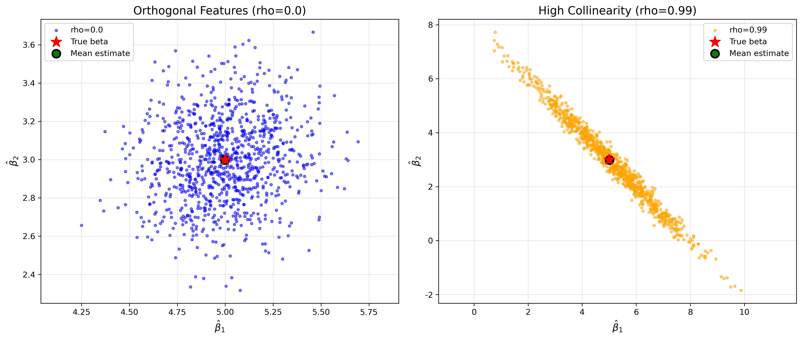

# Week 05 Report: Covariance & Multicollinearity

## 1. 实验目的
本次作业旨在通过 Monte Carlo Simulation 对普通最小二乘法（OLS）估计量的理论协方差矩阵进行数值验证，即

$$
\mathrm{Var}(\hat{\beta}) = \sigma^2 (X^T X)^{-1}
$$

同时结合可视化结果，考察当解释变量之间存在严重多重共线性时，参数估计的波动性及其相关结构将发生怎样的变化。

本实验采用如下设定：

- 真实参数：$\beta = [5.0, 3.0]^T$
- 噪声标准差：$\sigma = 2.0$
- 样本量：$n = 100$
- 每组实验重复次数：1000 次

按照题目要求，实验中对每一组设定均采用固定设计（fixed design）：即设计矩阵 $X$ 在组内保持不变，每次重复仅重新生成随机噪声 $\epsilon$。

为比较多重共线性对估计结果的影响，本文设置以下两组实验：

- 实验 A：$\rho = 0.0$，两个特征近似独立
- 实验 B：$\rho = 0.99$，两个特征高度正相关

## 2. 实验方法
首先，在 `data_generator.py` 中生成包含两个解释变量 $X_1$ 与 $X_2$ 的设计矩阵，并通过参数 $\rho$ 控制二者的相关程度。随后，在 `simulation.py` 中对固定设计矩阵进行 1000 次重复模拟。每次模拟均重新生成随机噪声，并据此构造响应变量，再利用 OLS 方法估计参数向量 $\hat{\beta}$。

在此基础上，分别记录两组实验中 1000 次估计得到的 $\hat{\beta}_1$ 与 $\hat{\beta}_2$，并完成以下分析：

- 比较参数估计的均值、标准差与偏差
- 计算经验协方差矩阵
- 与理论协方差矩阵 $\sigma^2 (X^T X)^{-1}$ 进行对照
- 通过散点图观察参数估计在不同相关结构下的分布形态

## 3. 可视化结果
下图给出了两组实验中 1000 次参数估计结果 $(\hat{\beta}_1, \hat{\beta}_2)$ 的散点分布：



从图中可以清楚看出：

- 在实验 A 中，散点围绕真实参数点 $(5, 3)$ 呈较为紧凑的近圆形分布；
- 在实验 B 中，散点仍以真实参数点为中心，但明显被拉伸为沿负斜率方向展开的椭圆形分布；
- 这表明在高共线性条件下，参数估计虽然总体上仍围绕真实值波动，但波动范围显著扩大，且两个参数估计之间出现了强烈的负相关关系。

因此，散点图不仅反映了方差的膨胀，也直观展示了协方差结构随共线性增强而发生的变化。

## 4. 参数估计结果摘要
程序运行得到的主要数值结果如下。

### 4.1 实验 A：$\rho = 0.0$

- Sample correlation between $X_1$ and $X_2$: `-0.136422`
- $\hat{\beta}_1$ mean = `4.997448`，std = `0.227048`
- $\hat{\beta}_2$ mean = `2.998472`，std = `0.220348`
- Bias($\hat{\beta}_1$) = `-0.002552`
- Bias($\hat{\beta}_2$) = `-0.001528`

### 4.2 实验 B：$\rho = 0.99$

- Sample correlation between $X_1$ and $X_2$: `0.988744`
- $\hat{\beta}_1$ mean = `5.008175`，std = `1.533802`
- $\hat{\beta}_2$ mean = `2.989165`，std = `1.562006`
- Bias($\hat{\beta}_1$) = `0.008175`
- Bias($\hat{\beta}_2$) = `-0.010835`

由上述结果可见，在两组实验中，参数估计的样本均值都非常接近真实参数值，说明 OLS 估计在本实验设定下仍保持无偏性。然而，当 $\rho$ 从 `0.0` 增大到 `0.99` 后，两个参数估计的标准差均从约 `0.22` 上升到约 `1.55`，表明多重共线性显著放大了估计量的方差。

## 5. 理论协方差矩阵与经验协方差矩阵对比
根据作业要求，重点比较实验 B 中的经验协方差矩阵与理论协方差矩阵。

### 5.1 Empirical Covariance Matrix

```text
[[ 2.3549049  -2.37222593]
 [-2.37222593  2.44230661]]
```

### 5.2 Theoretical Covariance Matrix $\sigma^2 (X^T X)^{-1}$

```text
[[ 2.18703581 -2.20560514]
 [-2.20560514  2.27461805]]
```

### 5.3 Difference Matrix (Empirical - Theoretical)

```text
[[ 0.16786909 -0.16662078]
 [-0.16662078  0.16768856]]
```

### 5.4 分析与说明
可以看到，经验协方差矩阵与理论协方差矩阵在数值上已经非常接近。虽然由于模拟次数有限，二者不可能完全一致，但目前的误差范围较小，说明通过 1000 次 Monte Carlo 模拟得到的结果已经较好地验证了课堂中的理论公式：

$$
\mathrm{Var}(\hat{\beta}) = \sigma^2 (X^T X)^{-1}
$$

这也表明当前程序实现与实验流程是正确的。

## 6. 关于强负相关现象的解释
从实验结果来看，当 $X_1$ 与 $X_2$ 高度正相关时，$\hat{\beta}_1$ 与 $\hat{\beta}_2$ 呈现出非常强的负相关关系。程序输出的相关系数如下：

- Orthogonal case correlation: `0.128611`
- Collinear case correlation: `-0.989166`
- Theoretical correlation: `-0.988885`

造成这一现象的根本原因在于：当两个解释变量提供的信息高度重合时，模型难以稳定地区分它们各自对响应变量的独立贡献。换言之，模型更容易识别的是二者合在一起所产生的总体解释效果，而不是每个变量单独应分配多少“贡献份额”。

因此，在重复抽样过程中：

- 如果某一次估计中 $\hat{\beta}_1$ 偏大，
- 为了维持整体拟合效果接近不变，$\hat{\beta}_2$ 往往就会相应偏小。

这种“此消彼长”的关系使得两者在散点图中形成沿负斜率方向延伸的椭圆分布，并最终表现为显著的负相关。这正是多重共线性在参数估计层面的典型表现。

## 7. 结论
综合上述实验结果，可以得到以下结论：

- OLS 估计量的经验协方差矩阵与理论协方差矩阵 $\sigma^2 (X^T X)^{-1}$ 基本一致，理论公式得到了数值验证。
- 多重共线性不会破坏 OLS 估计的无偏性，但会显著放大参数估计的方差。
- 当解释变量高度正相关时，参数估计之间会出现非常强的负相关关系。
- 这种现象在图形上表现为散点分布由近圆形转变为沿负斜率方向拉伸的椭圆形。

综上，本次实验不仅验证了课堂中的协方差理论，也直观说明了多重共线性会显著削弱参数估计的稳定性。

