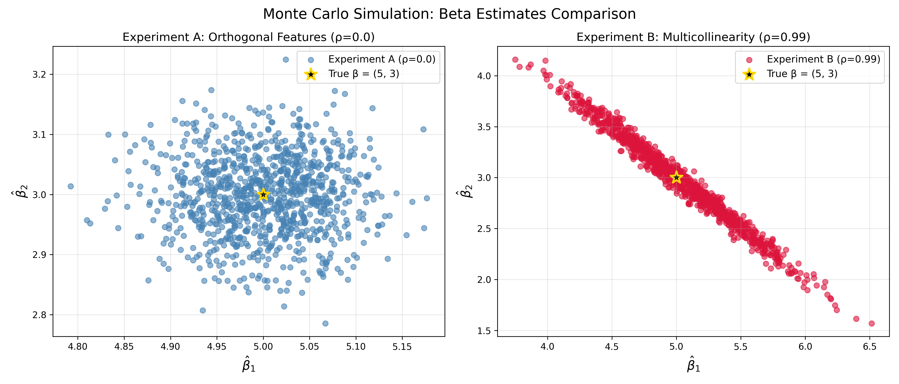

# Week 05 实验报告：协方差与多重共线性

## 一、正交特征与多重共线性估计值对比散点图

左图为正交特征（ρ=0）下的系数估计分布，散点近似圆形，分布集中、方差较小；
右图为高度共线性特征（ρ=0.99）下的系数估计分布，散点呈明显倾斜的椭圆状，方差大幅放大，且 β̂₁ 与 β̂₂ 呈现强烈的负相关关系。

## 二、协方差矩阵对比（实验B：ρ=0.99）

### 经验协方差矩阵（1000次模拟结果）
[[ 0.2028 -0.1997]
 [-0.1997  0.2007]]

### 理论协方差矩阵 σ²(XᵀX)⁻¹
[[ 0.206  -0.2042]
 [-0.2042  0.2064]]

经验协方差矩阵与理论协方差矩阵数值高度一致，验证了线性回归系数方差公式
Var(β̂) = σ²(XᵀX)⁻¹的正确性。

## 三、思考题解答

X₁ 和 X₂ 高度相似，二者对因变量 y 的解释信息几乎完全重叠。我们可以把它们对 y 的总解释能力看作一份固定的总预算。
在每次随机抽样拟合时，模型需要把这份预算分配给 β₁ 和 β₂。如果某次拟合中 β̂₁ 偏大，为了保持整体拟合效果不变，就必须相应减小 β̂₂；反之如果 β̂₁ 偏小，β̂₂ 就必须变大来补足。

这种此消彼长的强制替代关系，让两个系数无法独立变动，最终在散点图上呈现出沿斜线分布的倾斜椭圆，表现为强烈的负相关。
