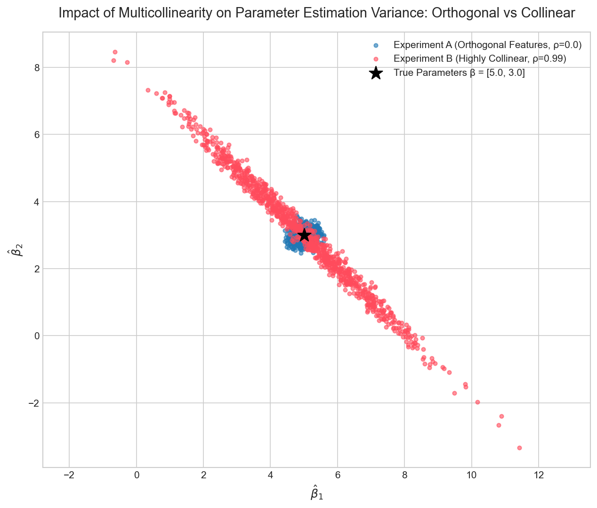

# Week 05 Report: Covariance & Multicollinearity

## 实验背景
通过蒙特卡洛模拟，验证当特征之间存在高度共线性时，OLS 估计量的协方差矩阵如何被放大，并观察估计量之间的负相关关系。

## 1. 实验结果说明

本次实验通过Monte Carlo模拟，比较了两个特征矩阵设计下线性回归系数估计值的差异：

- **实验 A：正交特征**，设定 \(\rho = 0.0\)。
- **实验 B：高度共线特征**，设定 \(\rho = 0.99\)。

真实参数设定为：\(\beta = [5.0, 3.0]^T\)。噪音标准差设定为 \(\sigma = 2.0\)。

## 2. 对比散点图

下面是两组实验的估计点对比图：



图中：
- 蓝色点表示实验 A 的 \(\hat{\beta}_1\) 与 \(\hat{\beta}_2\) 估计点。估计点呈紧凑的近似圆形团簇，β^​1​ 与 β^​2​ 几乎无相关，符合正交设计的统计性质。
- 红色点表示实验 B 的 \(\hat{\beta}_1\) 与 \(\hat{\beta}_2\) 估计点。估计点呈狭长倾斜椭圆，主轴呈明显负斜率，直观展示了 β^​1​ 与 β^​2​ 之间的强负相关结构。
- 黑色星号为真实参数点 \(\beta = [5.0, 3.0]\)，所有估计点均围绕其分布。

## 3. 终端打印的两个协方差矩阵

### 实验 A：正交特征（\(\rho = 0.0\)）

理论协方差矩阵 (σ²(XᵀX)⁻¹)：

```
[[0.0388 0.0029]
 [0.0029 0.0298]]
```

经验协方差矩阵(模拟 1000 次)：

```
[[0.0383 0.0036]
 [0.0036 0.029 ]] 
```
- 理论值与经验值高度一致，验证了协方差公式的正确性。非对角线元素接近 0，表明估计量 β^​1​ 和 β^​2​ 几乎不相关。

### 实验 B：高度共线特征（\(\rho = 0.99\)）

理论协方差矩阵：

```
[[ 3.317  -3.225 ]
 [-3.225   3.1726]]
```

经验协方差矩阵：

```
[[ 3.1818 -3.0933]
 [-3.0933  3.0455]]
```
- 理论值与经验值同样高度吻合。非对角线元素为较大负数，表明 β^​1​ 与 β^​2​ 存在强烈负相关。同时对角线元素相比正交情形急剧放大，体现多重共线性带来的方差膨胀效应。

## 4. 思考题：

当 \(X_1\) 和 \(X_2\) 高度正相关 \(\rho = 0.99\) 时，散点图显示 \(\hat{\beta}_1\) 与 \(\hat{\beta}_2\) 的估计结果沿一条斜线分布，并呈现强烈的负相关。

从代数角度，OLS 估计量的协方差矩阵为Var(β^​)=σ2(XTX)−1当 X1​ 与 X2​ 高度线性相关时，XTX 接近奇异，其逆矩阵的对角线元素急剧增大（方差膨胀），非对角线元素则呈现显著负值，直接导致参数估计负相关。

从直观的 “预算分配” 角度理解：由于 X1​ 和 X2​ 几乎成比例，模型难以区分二者对 y 的独立贡献。为了维持整体拟合效果基本不变，如果某次随机模拟中 β^​1​ 偏高，β^​2​ 就必须相应偏低以 “抵消” 多余贡献；反之亦然。

这种此消彼长的分配机制，使得 β^​1​ 与 β^​2​ 呈现强烈负相关，在散点图上表现为一条从左上到右下的狭长椭圆。

## 5. 结论
1.理论协方差矩阵与经验协方差矩阵高度吻合，验证了经典线性回归理论公式的正确性。
2.多重共线性不会破坏估计的无偏性，但会显著放大参数方差，并引入估计量之间的强负相关。
3.散点图从 “紧凑圆形” 到 “狭长倾斜椭圆” 的变化，为多重共线性的影响提供了清晰直观的可视化证据。