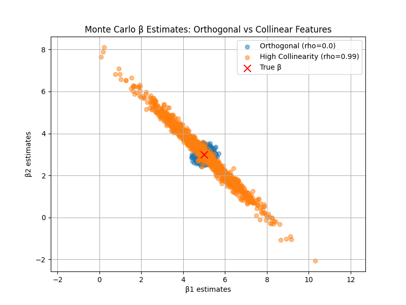

# 第5周实验报告：多重共线性与OLS估计的协方差分析

---

## 一、实验背景与目的

### 1.1 实验背景

在理论课中，我们推导了OLS估计量的协方差公式：
$$
\text{Var}(\hat{\beta}) = \sigma^2 (X^\top X)^{-1}
$$
本实验通过蒙特卡洛模拟直观展示：当特征之间存在高度多重共线性时，协方差矩阵会显著膨胀，估计量方差增大，同时系数估计值之间出现强负相关。

### 1.2 实验目的

1. 构造具有不同相关性的特征矩阵，进行正交与高度共线的对比实验。
2. 通过1000次蒙特卡洛模拟，记录OLS系数估计值的分布。
3. 对比经验协方差矩阵与理论协方差矩阵，验证公式的正确性。
4. 可视化正交与共线条件下的估计分布差异，并解释统计学原因。

---

## 二、实验环境与文件结构

### 2.1 实验环境

* **操作系统**: Windows 11 + WSL2 (Ubuntu 22.04)
* **编程语言**: Python 3.11
* **核心依赖**: `numpy`, `matplotlib`
* **开发工具**: VS Code

### 2.2 文件结构

```
week05/
├── docs/
│   ├── report.md # 本实验报告
│   └── Figure_1.png # 系数散点图
└── src/
    ├── data_generator.py # 构造 DGP
    ├── simulation.py # 蒙特卡洛模拟与协方差计算
    ├── analysis.py # 可视化绘图
    └── main.py # 主程序入口
```

---

## 三、实验设计与实现

### 3.1 核心参数设定

* **真实系数**: $\beta = [5.0, 3.0]^\top$
* **噪声标准差**: $\sigma = 2.0$
* **样本量**: $n = 100$
* **模拟次数**: 1000 次
* **对比实验**:

  * **实验A (正交特征)**: 相关系数 $\rho = 0.0$
  * **实验B (高度共线性)**: 相关系数 $\rho = 0.99$

### 3.2 关键实现要点

1. **固定设计矩阵**: 在循环外生成一次 $X$，每次模拟仅生成新的噪声 $\epsilon$。
2. **协方差计算**: 使用 `numpy.cov()` 得到经验协方差矩阵，并与理论协方差 $\sigma^2 (X^\top X)^{-1}$ 对比。

---

## 四、实验结果与分析

### 4.1 系数估计分布散点图



* **正交特征 ($\rho=0.0$)**: 蓝色点集呈圆形分布，集中在真实参数点附近，方差较小，系数之间无明显相关性。
* **高度共线性 ($\rho=0.99$)**: 橙色点集呈倾斜椭圆，长轴明显拉长，说明估计方差大，且 $\hat{\beta}_1$ 与 $\hat{\beta}_2$ 呈强负相关。

### 4.2 协方差矩阵对比

#### 经验协方差矩阵 (Empirical Covariance, B)

```
 [[ 2.06783912 -2.01702203]
 [-2.01702203  2.00664025]]
```

#### 理论协方差矩阵 (Theoretical Covariance, B)

```
 [[ 2.24921036 -2.20647717]
 [-2.20647717  2.20462493]]
```

**分析**:

1. **一致性验证**: 经验矩阵与理论矩阵数值接近，验证了公式 $\sigma^2 (X^\top X)^{-1}$ 的正确性。
2. **方差膨胀**: 对角线数值远大于正交情况，体现共线性导致方差膨胀。
3. **负相关验证**: 非对角线元素为强负值，反映高度共线下系数估计的强负相关。

---

## 五、思考题解答

**问题**: 当 $X_1$ 和 $X_2$ 高度正相关 ($\rho=0.99$) 时，为什么 $\hat{\beta}_1$ 和 $\hat{\beta}_2$ 会呈强负相关？

**解答**:

* 高度相关的特征共享对因变量 $y$ 的解释力。
* OLS回归在分配解释力时，如果一次抽样中 $\hat{\beta}_1$ 偏大，为避免重复解释，$\hat{\beta}_2$ 必须偏小。
* 这种“此消彼长”的关系导致两系数估计值呈强负相关。
* 散点图中倾斜椭圆形状直观展示了这一现象。

---

## 六、实验结论

1. **正交特征条件下**: OLS估计稳定、方差小、系数独立。
2. **共线性影响**: 不影响无偏性，但显著增加估计方差，并产生负相关系数。
3. **理论验证**: 蒙特卡洛模拟与公式高度一致，直观验证 $\text{Var}(\hat{\beta}) = \sigma^2 (X^\top X)^{-1}$。
4. **建模启示**: 实务中需警惕多重共线性，否则参数估计与解释不可靠。
