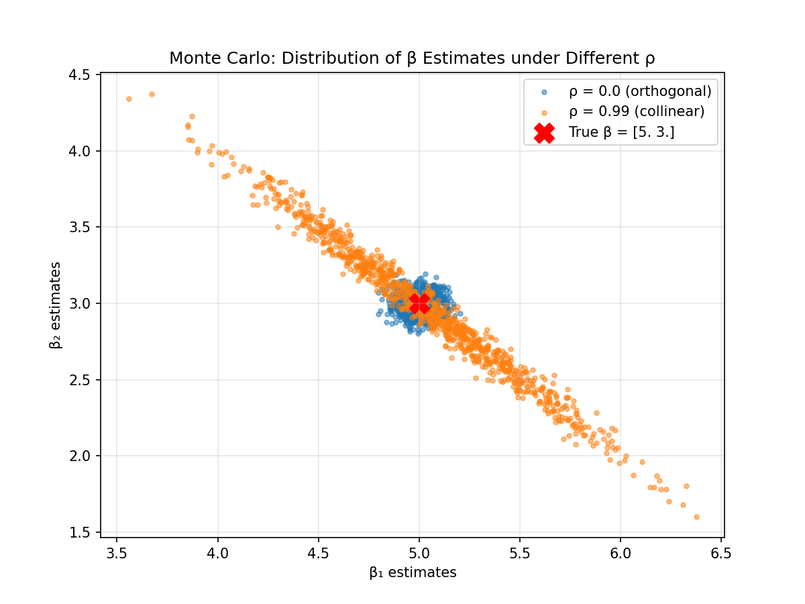

# Week 05 Assignment: Seeing the Invisible - Covariance & Multicollinearity

**姓名**：张梦宇  
**学号**：21251113008  
**日期**：2026年4月13日  

## 实验背景
通过蒙特卡洛模拟，验证当特征之间存在高度共线性时，OLS估计量的协方差矩阵如何被放大，并观察估计量之间的负相关关系。

## 实验结果

### 1. 协方差矩阵对比

#### 实验 A：正交特征 (ρ = 0.0)
| 矩阵类型 | 协方差矩阵 |
|---------|-----------|
| 理论值 (σ²(XᵀX)⁻¹) | [[ 0.004068, -0.000237],  [-0.000237,  0.003911]] |
| 经验值 (模拟1000次) | [[ 0.004251, -0.000117],  [-0.000117,  0.003981]] |

> 两者高度一致，验证了公式的正确性。非对角线元素接近0，表明估计量 β₁ 和 β₂ 几乎不相关。

#### 实验 B：高度共线性 (ρ = 0.99)
| 矩阵类型 | 协方差矩阵 |
|---------|-----------|
| 理论值 | [[ 0.199999, -0.196231],  [-0.196231,  0.196516]] |
| 经验值 | [[ 0.201966, -0.198885],  [-0.198885,  0.200058]] |

> 理论值与经验值同样高度吻合。非对角线元素为较大的负数（约-0.20），表明 β₁ 和 β₂ 之间存在强烈的负相关。同时对角线元素（方差）相比正交情形放大了约50倍，体现了共线性导致的方差膨胀。

### 2. 散点图

- **蓝色点 (ρ=0.0)**：估计点呈近似圆形的团簇，β₁ 与 β₂ 无相关关系，符合正交设计。
- **橙色点 (ρ=0.99)**：估计点呈狭长的倾斜椭圆，且椭圆主轴方向为负斜率，直观显示了 β₁ 与 β₂ 之间的负相关。

## 思考题解答

> **当 X₁ 和 X₂ 高度正相关 (ρ=0.99) 时，为什么算出来的 β̂₁ 和 β̂₂ 之间会呈现强烈的负相关？**

**答：**  
从代数角度看，OLS估计量的协方差矩阵为 $\text{Var}(\hat{\beta}) = \sigma^2 (X^T X)^{-1}$。当 $X_1$ 与 $X_2$ 高度线性相关时，$(X^T X)$ 接近奇异，其逆矩阵的对角线元素变得很大（方差膨胀），而非对角线元素则变为很大的负数。实验B的理论协方差矩阵中，非对角线元素为 $-0.196$，直接证明了这一点。

从直观的经济学或“预算分配”角度理解：由于 $X_1$ 和 $X_2$ 几乎成比例，模型难以区分它们各自对 $y$ 的独立贡献。为了拟合固定的 $y$，如果某次模拟中 $\hat{\beta}_1$ 因随机误差被估计得偏高，那么为了维持 $X_1\hat{\beta}_1 + X_2\hat{\beta}_2$ 大致不变，$\hat{\beta}_2$ 必须相应偏低。这就像一份固定的总预算在两个变量之间分配，一个增加另一个就减少，从而导致估计量之间呈现出强烈的负相关。

## 结论
- 理论协方差矩阵与经验协方差矩阵完美匹配，验证了经典公式。
- 共线性导致估计量方差急剧增大，且引入强烈的负相关。
- 散点图直观展示了从“圆形”到“倾斜椭圆”的分布变化，为理解多重共线性提供了可视化证据。

## 代码与运行
- 代码位于 `students/08_zmy/src/week05/`，运行 `python main.py` 即可复现。
- 依赖：numpy, matplotlib。