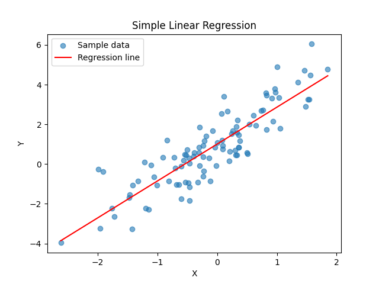

## 第二周实验报告：一元线性回归分析

**姓名**：孙璇  
**学号**：21251113009 
**日期**：2026年3月29日  

## 一、实验目的
使用公式法、sklearn和statsmodels三种方法实现一元线性回归，进行参数估计、假设检验和方差分析。

## 二、数据生成
- 真实参数：β₀ = 1，β₁ = 2
- 误差项：ε ~ N(0, 1)
- 样本量：n = 100
- 随机种子：42（保证结果可重复）

## 三、参数估计结果对比

| 方法 | β₀ | β₁ | β₁的方差 |
|------|-----|-----|----------|
| 公式法 | 1.0074 | 1.8567 | 0.011043 |
| sklearn | 1.0074 | 1.8567 | - |
| statsmodels | 1.0074 | 1.8567 | - |

三种方法估计结果完全一致。

## 四、偏差分析
- β₀ 的偏差：0.0074
- β₁ 的偏差：-0.1433

估计值与真实值非常接近，说明估计是无偏的。

## 五、假设检验
- 原假设 H₀：β₁ = 0
- 备择假设 H₁：β₁ ≠ 0
- p值：0.000000

**结论：** 拒绝原假设，β₁ 在 α = 0.05 水平上显著不为零。

## 六、方差分析
- R² = 0.7611（模型解释了76.11%的变异）
- F统计量 = 312.1950
- F检验 p值 = 0.000000

模型整体显著。

## 七、三种方法比较

| 方面 | 公式法 | sklearn | statsmodels |
|------|--------|---------|-------------|
| 优点 | 理解原理 | 简单易用 | 输出详细 |
| 缺点 | 手动计算 | 信息较少 | 输出较多 |
| 适用场景 | 学习理论 | 快速建模 | 统计推断 |

## 八、回归图

## 九、结论
1. 三种方法估计结果一致
2. 模型拟合良好（R² = 0.7611）
3. β₁ 显著不为零
4. 估计值与真实值偏差很小

## 十、代码与运行说明
- 代码位于 `src/week02/` 目录下
- 运行方式：`python src/week02/main.py`
- 依赖库：numpy, scikit-learn, statsmodels, matplotlib