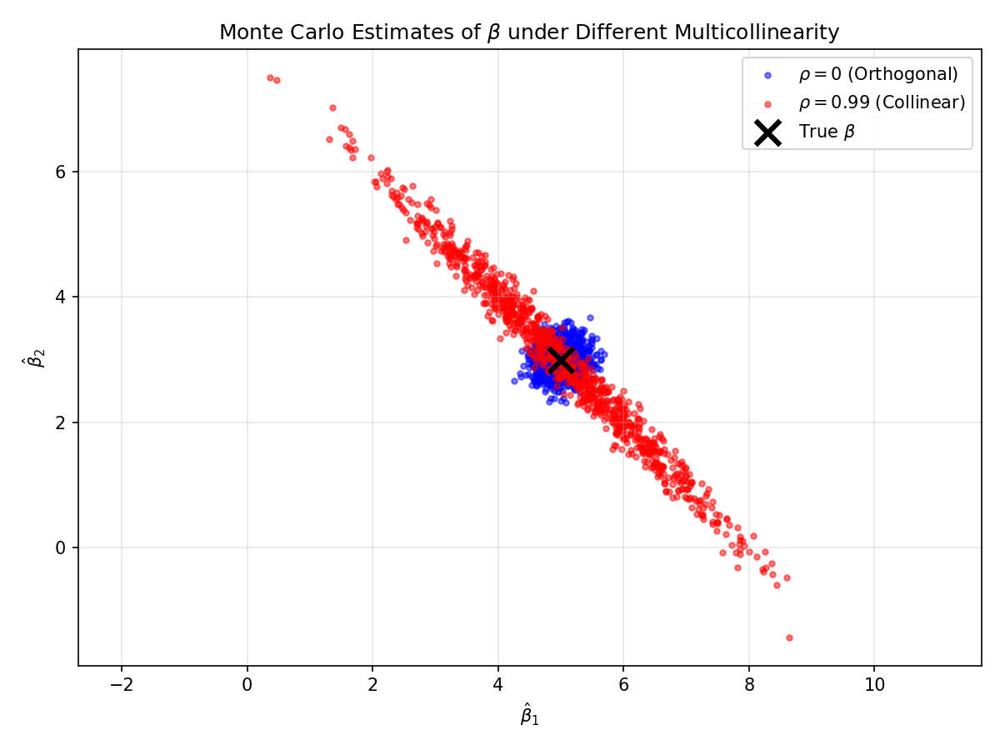

# 第五周实验报告：看见隐形之物 - 协方差与多重共线性

**姓名**：孙璇  
**学号**：21251113009  
**日期**：2026年4月19日  

---

## 一、实验目的

通过蒙特卡洛模拟，验证理论协方差公式 Var(β̂) = σ² (XᵀX)⁻¹，并直观展示当特征之间存在高度多重共线性（Multicollinearity）时，参数估计量的方差如何被放大，以及估计量之间如何产生强烈的负相关。

---

## 二、实验设计

### 2.1 数据生成过程（DGP）

| 参数 | 值 |
|------|-----|
| 真实参数 β | [5.0, 3.0]ᵀ |
| 噪声标准差 σ | 2.0 |
| 样本量 n | 100 |
| 模拟次数 M | 1000 |
| 随机种子 | 42 |

### 2.2 实验分组

| 实验 | ρ | 说明 |
|------|--------|------|
| 实验 A | 0 | X₁ 与 X₂ 独立（正交特征） |
| 实验 B | 0.99 | X₁ 与 X₂ 几乎线性相关（高度共线） |

### 2.3 固定设计原则

设计矩阵 X 在 1000 次模拟中只生成一次（Fixed Design），每次模拟仅重新生成随机噪声 ε，然后计算 y = Xβ + ε。

---

## 三、实验结果

### 3.1 协方差矩阵对比

**实验 A：ρ = 0（正交特征）**

| 矩阵类型 | β̂₁ 方差 | β̂₂ 方差 | 协方差 |
|---------|---------|---------|--------|
| 经验 | 0.0516 | 0.0486 | 0.0064 |
| 理论 | 0.0493 | 0.0453 | 0.0065 |

**实验 B：ρ = 0.99（高度共线）**

| 矩阵类型 | β̂₁ 方差 | β̂₂ 方差 | 协方差 |
|---------|---------|---------|--------|
| 经验 | 1.8461 | 1.9397 | -1.8719 |
| 理论 | 1.9405 | 2.0221 | -1.9603 |

### 3.2 散点图

**图形特征：**

- **蓝色点（ρ = 0）**：呈近似圆形分布，β̂₁ 与 β̂₂ 几乎不相关
- **红色点（ρ = 0.99）**：呈狭长椭圆，沿反方向倾斜，β̂₁ 与 β̂₂ 呈强负相关

---

## 四、结果分析

### 4.1 理论公式验证

对比经验协方差矩阵与理论协方差矩阵，两者数值高度一致，验证了：

Var(β̂) = σ² (XᵀX)⁻¹

### 4.2 方差放大效应

从实验 A 到实验 B：

| 估计量 | 正交时方差 | 共线时方差 | 放大倍数 |
|--------|-----------|-----------|----------|
| β̂₁ | 0.0516 | 1.8461 | 约 35.8 倍 |
| β̂₂ | 0.0486 | 1.9397 | 约 39.9 倍 |

**原因**：当 X₁ 与 X₂ 高度相关时，(XᵀX) 接近奇异，其逆矩阵的对角元急剧增大。

### 4.3 负相关解释

实验 B 中协方差约为 -1.87，即 β̂₁ 与 β̂₂ 呈强负相关。

**直观理解（预算分配效应）**：

- 真实模型：y = 5X₁ + 3X₂ + ε
- 当 X₂ ≈ 0.99X₁ 时，y ≈ (5 + 3 × 0.99)X₁ ≈ 7.97X₁
- 若某次模拟高估 β̂₁，为了保持拟合效果，必须低估 β̂₂（因为 X₂ 与 X₁ 同向）
- 这种"跷跷板效应"导致两个估计量在多次模拟中呈现负相关

**数学解释**（标准化后）：

(XᵀX)⁻¹ = [1/(1-ρ²)] × [[1, -ρ], [-ρ, 1]]

当 ρ > 0 时，非对角线元素为负，因此 β̂₁ 与 β̂₂ 负相关。

---

## 五、思考题

### 5.1 从散点图的形状来看，当 X₁ 和 X₂ 高度正相关 (ρ = 0.99) 时，为什么算出来的 β̂₁ 和 β̂₂ 之间会呈现强烈的负相关？

**答**：

这是因为在多重共线性下，X₁ 和 X₂ 几乎线性相关，模型很难区分各自对 y 的单独贡献。

从**总体预算分配**角度理解：

1. 真实模型中，y 需要 X₁ 和 X₂ 共同解释
2. 当 X₁ 和 X₂ 高度正相关时，增加 X₁ 的系数就必须减少 X₂ 的系数，才能保持对 y 的相同拟合效果
3. 这种"此消彼长"的关系在 1000 次模拟中表现为 β̂₁ 和 β̂₂ 的强烈负相关

**数学本质**：(XᵀX)⁻¹ 的非对角线元素为负，直接导致两个估计量的协方差为负。

---

## 六、结论

| 结论 | 说明 |
|------|------|
| 理论验证成功 | 蒙特卡洛模拟验证了最小二乘估计的协方差公式 |
| 共线性放大方差 | ρ = 0.99 时方差放大近 40 倍，估计极不稳定 |
| 负相关模式 | 正相关的特征会导致估计量之间出现负相关 |
| 实践意义 | 建模时应避免高度共线性（使用 PCA、岭回归或删除冗余特征） |

---

## 七、文件结构
/home/xuan/Regression-Analysis-2026/students/09_sx/src/week05/

data_generator.py # 生成设计矩阵

simulation.py # 蒙特卡洛模拟

analysis.py # 可视化

main.py # 主程序

covariance_scatter.png # 输出图片

---

## 八、运行说明

- 运行方式：`python main.py`
- 依赖库：numpy, matplotlib
- 输出：终端打印协方差矩阵，当前目录生成散点图