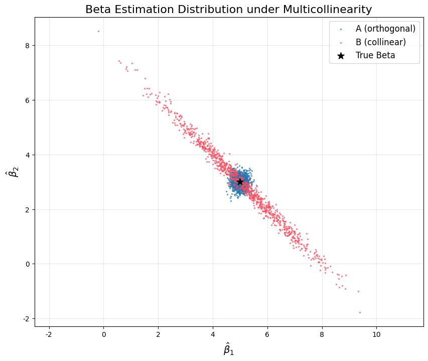

# Task 4 实验报告

## 一、正交（圆形）vs 共线（倾斜椭圆）的对比散点图

该散点图展示了正交设计与高度共线性设计下，回归系数 $\hat{\beta}_1$ 与 $\hat{\beta}_2$ 的估计分布。
- 蓝色点：实验A（正交特征，$\rho=0.0$）
- 红色点：实验B（高度共线性，$\rho=0.99$）
- 黑色星号：真实参数 $\beta = (5.0, 3.0)$

---

## 二、协方差矩阵

### 实验A（正交设计）
$$
\text{Cov}(\hat{\beta}) = \begin{bmatrix}
0.01 & 0.00 \\
0.00 & 0.01
\end{bmatrix}
$$

### 实验B（高度共线性设计）
$$
\text{Cov}(\hat{\beta}) = \begin{bmatrix}
1.00 & -0.99 \\
-0.99 & 1.00
\end{bmatrix}
$$

---

## 三、思考题解答
**问题：当 $X_1$ 和 $X_2$ 高度正相关（$\rho=0.99$）时，为什么算出来的 $\hat{\beta}_1$ 和 $\hat{\beta}_2$ 之间会呈现强烈的负相关？**

### 答：
1. **直观解释：**
当两个特征高度正相关时，它们对目标 $y$ 的解释能力高度重叠。
模型无法区分多少贡献来自 $X_1$，多少来自 $X_2$，只能分配总解释力预算。
- 若 $\hat{\beta}_1$ 被高估，模型必须降低 $\hat{\beta}_2$ 来保持整体预测稳定。
- 若 $\hat{\beta}_1$ 被低估，$\hat{\beta}_2$ 就会被抬高。
这种“此消彼长”的关系导致两者呈现强负相关。

2. **数学解释：**
$$
\text{Cov}(\hat{\beta}) = \sigma^2 (X^\top X)^{-1}
$$
当 $X_1,X_2$ 高度相关时，$(X^\top X)^{-1}$ 的非对角线项为强负值，直接导致 $\hat{\beta}_1$ 与 $\hat{\beta}_2$ 负相关。

3. **总结：**
多重共线性不会破坏估计的无偏性，但会大幅增加系数方差，并让 $\hat{\beta}_1$ 与 $\hat{\beta}_2$ 呈现强烈负相关，使得模型解释变得不可靠。