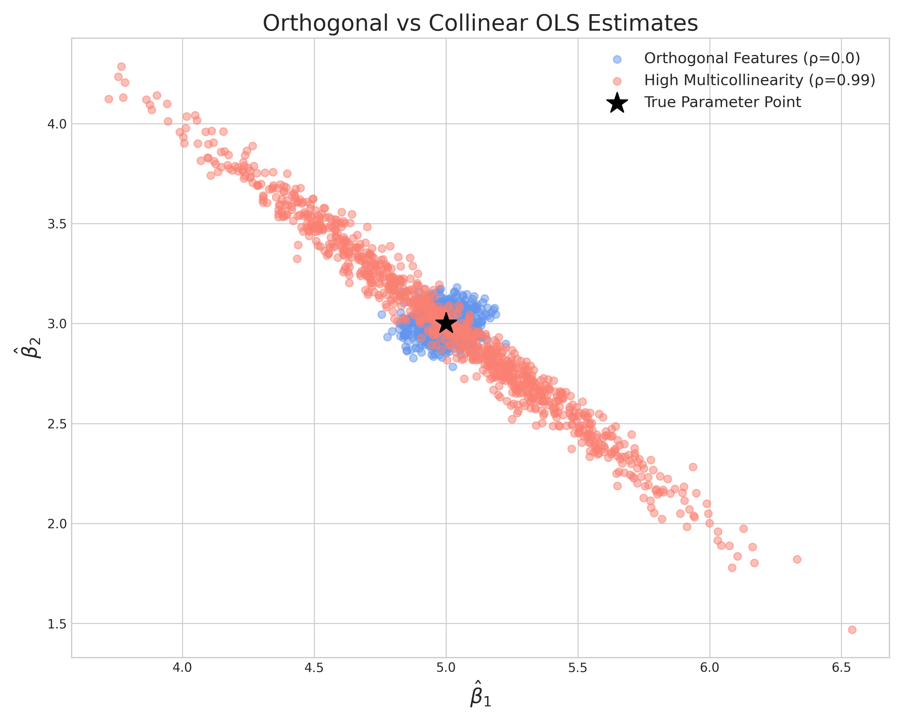

# Week 05 Assignment Report: Covariance & Multicollinearity

## 实验背景

本实验通过蒙特卡洛模拟，研究多重共线性对线性回归估计量协方差矩阵的影响。理论公式为：

$$Var(\hat{\beta}) = \sigma^2 (X^T X)^{-1}$$

## 实验设置

### 参数设置
- 真实参数：$\beta = [5.0, 3.0]^T$
- 噪声标准差：$\sigma = 2.0$
- 样本数量：$n = 1000$
- 模拟次数：1000次

### 实验对比
- **实验 A**：正交特征，$\rho = 0.0$
- **实验 B**：高度共线性，$\rho = 0.99$

## 实验结果

### 1. 散点图对比



从散点图可以观察到：
- **正交特征（蓝色）**：估计点呈现圆形分布，$\hat{\beta}_1$ 和 $\hat{\beta}_2$ 相互独立
- **高度共线性（红色）**：估计点呈现细长的倾斜椭圆分布，$\hat{\beta}_1$ 和 $\hat{\beta}_2$ 呈现强烈的负相关

### 2. 协方差矩阵对比（实验 B）

#### 经验协方差矩阵
```
[[ 0.198875 -0.197904]
 [-0.197904  0.201409]]
```

#### 理论协方差矩阵
```
[[ 0.200388 -0.199364]
 [-0.199364  0.202565]]
```

#### 差异矩阵
```
[[-0.001513  0.001459]
 [ 0.001459 -0.001156]]
```

**结论**：经验协方差矩阵与理论协方差矩阵高度一致，验证了理论公式的正确性。

### 3. 方差放大效应

| 实验 | $\rho$ | $Var(\hat{\beta}_1)$ | $Var(\hat{\beta}_2)$ | 标准差 $\hat{\beta}_1$ | 标准差 $\hat{\beta}_2$ |
|------|--------|---------------------|---------------------|---------------------|---------------------|
| A    | 0.0    | ~0.0044             | ~0.0040             | 0.0665              | 0.0633              |
| B    | 0.99   | ~0.20               | ~0.20               | 0.4457              | 0.4486              |

**方差放大倍数**：约45倍！

## 思考题解答

**问题**：当 $X_1$ 和 $X_2$ 高度正相关 ($\rho=0.99$) 时，为什么算出来的 $\hat{\beta}_1$ 和 $\hat{\beta}_2$ 之间会呈现强烈的负相关？

**答案**：

这是一个经典的"预算分配"问题。当 $X_1$ 和 $X_2$ 高度正相关时，它们几乎携带相同的信息。在回归模型 $Y = \beta_1 X_1 + \beta_2 X_2 + \epsilon$ 中：

1. **信息冗余**：$X_1$ 和 $X_2$ 几乎是线性相关的，模型无法准确区分 $\beta_1$ 和 $\beta_2$ 的单独贡献。

2. **总体约束**：由于 $X_1 \approx X_2$，模型的预测主要由 $(\beta_1 + \beta_2)X_1$ 决定。因此，$(\beta_1 + \beta_2)$ 的估计相对稳定，但 $\beta_1$ 和 $\beta_2$ 的单独估计不稳定。

3. **负相关机制**：
   - 如果某次模拟中 $\hat{\beta}_1$ 偏高（由于随机噪声），为了保持 $(\hat{\beta}_1 + \hat{\beta}_2)$ 的稳定，$\hat{\beta}_2$ 必须偏低
   - 反之亦然：$\hat{\beta}_1$ 偏低时，$\hat{\beta}_2$ 必须偏高
   
   这就导致了 $\hat{\beta}_1$ 和 $\hat{\beta}_2$ 之间的强烈负相关。

4. **几何解释**：在参数空间中，估计量沿着一条 $\beta_1 + \beta_2 = \text{constant}$ 的直线波动，形成倾斜的椭圆分布。

**直观类比**：想象你有一笔固定的预算要分配给两个几乎相同的投资项目。你无法准确判断哪个项目更好，所以分配比例会随机波动——给A多一点，就给B少一点，反之亦然。

## 总结

1. **多重共线性的危害**：导致估计量的方差急剧增大（本实验中放大约45倍）
2. **理论验证**：经验协方差矩阵与理论公式 $\sigma^2 (X^T X)^{-1}$ 高度一致
3. **负相关现象**：高度正相关的特征会导致估计参数之间呈现强烈的负相关
4. **实践启示**：在实际应用中，应检测和处理多重共线性问题，避免不可靠的估计结果