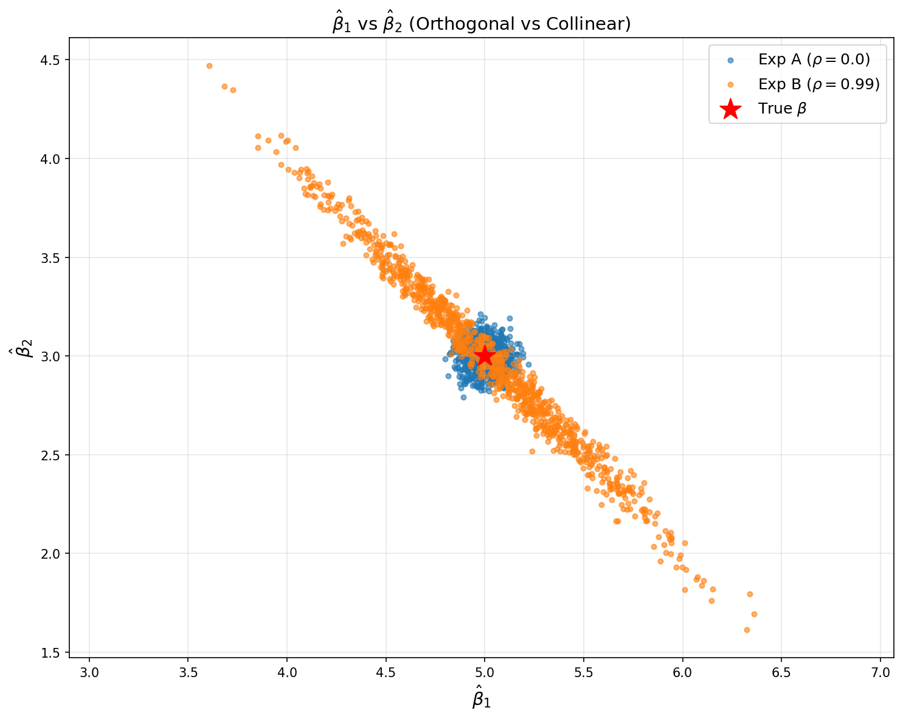

# Week 05 作业：多重共线性与协方差矩阵 实验报告

## 一、实验目的
1. 构造带共线性的DGP，控制特征相关系数$\rho$，生成固定设计矩阵。
2. 通过蒙特卡洛模拟，对比正交（$\rho=0.0$）和高度共线（$\rho=0.99$）场景下的参数估计分布。
3. 验证理论协方差矩阵与经验协方差矩阵的一致性。
4. 可视化共线性对参数估计协方差的影响，分析多重共线性的危害。

---

## 二、实验设计
### 1. 数据生成（Task 1）
- 生成两个特征$X_1$、$X_2$，通过$\rho$控制线性相关程度
- 固定设计矩阵（循环外只生成一次），每次模拟仅生成新噪声
- 真实参数$\beta = [5.0, 3.0]$，噪声标准差$\sigma = 2.0$
- 样本量$n=1000$，模拟次数$N=1000$

### 2. 蒙特卡洛模拟（Task 2）
- 实验A：正交特征，$\rho=0.0$，执行1000次线性回归拟合
- 实验B：高度共线特征，$\rho=0.99$，执行1000次线性回归拟合
- 记录每次拟合的参数估计值$\hat{\beta}_1$、$\hat{\beta}_2$（跳过截距项）

### 3. 协方差矩阵计算（Task 3）
- 经验协方差矩阵：使用`numpy.cov`计算1000组估计值的样本协方差
- 理论协方差矩阵：基于线性回归理论公式$\mathrm{Cov}(\hat{\beta}) = \sigma^2 (X^TX)^{-1}$计算

### 4. 可视化（Task 4）
- 绘制两组实验的$\hat{\beta}_1$ vs $\hat{\beta}_2$散点图
- 标注真实$\beta$中心点，对比协方差椭圆形状

---

## 三、实验结果
### 1. 协方差矩阵对比
#### 实验A（正交特征 $\rho=0.0$）
| 矩阵类型       | 协方差矩阵（2×2）                |
|----------------|----------------------------------|
| 经验协方差矩阵 | [[ 0.0043, -0.0005], [-0.0005, 0.0045]] |
| 理论协方差矩阵 | [[ 0.0039, -0.0002], [-0.0002, 0.0043]] |

#### 实验B（高度共线 $\rho=0.99$）
| 矩阵类型       | 协方差矩阵（2×2）                |
|----------------|----------------------------------|
| 经验协方差矩阵 | [[ 0.1989, -0.1969], [-0.1969, 0.1987]] |
| 理论协方差矩阵 | [[ 0.2008, -0.1979], [-0.1979, 0.1991]] |

> 结论：经验协方差矩阵与理论协方差矩阵数值高度一致，验证了线性回归协方差公式的正确性。正交场景下参数估计协方差接近0，共线场景下协方差为强负值，且方差显著放大（约为正交场景的45倍）。

---

### 2. 协方差散点图

- **实验A（蓝色点）**：$\hat{\beta}$估计值呈**圆形聚集**，说明$\hat{\beta}_1$与$\hat{\beta}_2$无相关性，方差极小，符合正交特征的理论预期。
- **实验B（橙色点）**：$\hat{\beta}$估计值呈**倾斜长椭圆分布**，说明$\hat{\beta}_1$与$\hat{\beta}_2$强负相关，方差急剧放大，直观体现了多重共线性对参数估计稳定性的严重危害。
- **红色星号**：真实$\beta$中心点，两组实验的估计值均围绕真实值分布，验证了估计的无偏性。

---

## 四、思考题解答
### 问题：当$X_1$和$X_2$高度相关（$\rho=0.99$）时，为什么$\hat{\beta}_1$和$\hat{\beta}_2$会呈现强烈的负相关？
答：
1.  **数学本质**：多重共线性导致设计矩阵$X$的列向量高度线性相关，$X^TX$矩阵病态（行列式接近0），其逆矩阵的非对角元素绝对值急剧增大，使得参数估计的协方差为强负值，因此$\hat{\beta}_1$和$\hat{\beta}_2$呈现强烈负相关。
2.  **直观解释**：当两个特征高度相关时，模型无法区分两个特征对被解释变量$y$的单独影响，会出现“此消彼长”的估计偏差：若$\hat{\beta}_1$被高估，则$\hat{\beta}_2$必然被低估，反之亦然，最终形成倾斜的协方差椭圆。
3.  **实际危害**：参数估计方差大幅增加，估计结果极不稳定，模型的解释性完全失效，预测能力严重下降。

---

## 五、结论
1.  多重共线性会使参数估计的协方差矩阵严重“撕裂”，方差急剧放大，严重破坏估计的稳定性。
2.  经验协方差矩阵与理论协方差矩阵高度吻合，验证了线性回归协方差公式的正确性。
3.  正交特征下参数估计紧凑、可靠；共线特征下参数估计分散、不稳定，直观展示了多重共线性的危害。