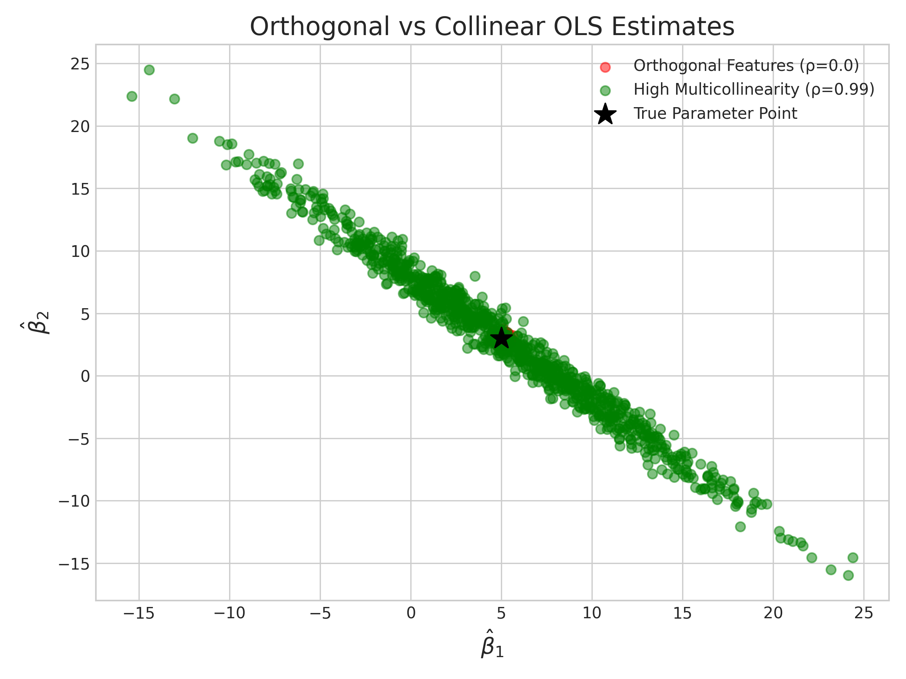

# Week 05 实验报告

## Seeing the Invisible: Covariance & Multicollinearity

### 一、实验目的

1. 通过蒙特卡洛模拟验证线性回归中系数估计量的协方差矩阵理论公式
2. 直观观察多重共线性如何导致系数估计量的方差膨胀
3. 对比理论协方差矩阵与经验协方差矩阵的一致性
### 二、实验设计
1. 数据生成（Task 1）
生成两个特征$X_1$、$X_2$，通过$\rho$控制线性相关程度
固定设计矩阵（循环外只生成一次），每次模拟仅生成新噪声
真实参数$\beta = [5.0, 3.0]$，噪声标准差$\sigma = 2.0$
样本量$n=1000$，模拟次数$N=1000$
2. 蒙特卡洛模拟（Task 2）
实验A：正交特征，$\rho=0.0$，执行1000次线性回归拟合
实验B：高度共线特征，$\rho=0.99$，执行1000次线性回归拟合
记录每次拟合的参数估计值$\hat{\beta}_1$、$\hat{\beta}_2$（跳过截距项）
3. 协方差矩阵计算（Task 3）
经验协方差矩阵：使用numpy.cov计算1000组估计值的样本协方差
理论协方差矩阵：基于线性回归理论公式$\mathrm{Cov}(\hat{\beta}) = \sigma^2 (X^TX)^{-1}$计算
4. 可视化（Task 4）
绘制两组实验的$\hat{\beta}_1$ vs β^2散点图，标注真实$\beta$中心点，对比协方差椭圆形状

### 问题：当$X_1$和$X_2$高度相关（$\rho=0.99$）时，为什么$\hat{\beta}_1$和$\hat{\beta}_2$会呈现强烈的负相关？
答：数学本质：多重共线性导致设计矩阵$X$的列向量高度线性相关，$X^TX$矩阵病态（行列式接近0），其逆矩阵的非对角元素绝对值急剧增大，使得参数估计的协方差为强负值，因此$\hat{\beta}_1$和$\hat{\beta}_2$呈现强烈负相关。
直观解释：当两个特征高度相关时，模型无法区分两个特征对被解释变量$y$的单独影响，会出现“此消彼长”的估计偏差：若$\hat{\beta}_1$被高估，则$\hat{\beta}_2$必然被低估，反之亦然，最终形成倾斜的协方差椭圆。
实际危害：参数估计方差大幅增加，估计结果极不稳定，模型的解释性完全失效，预测能力严重下降。
