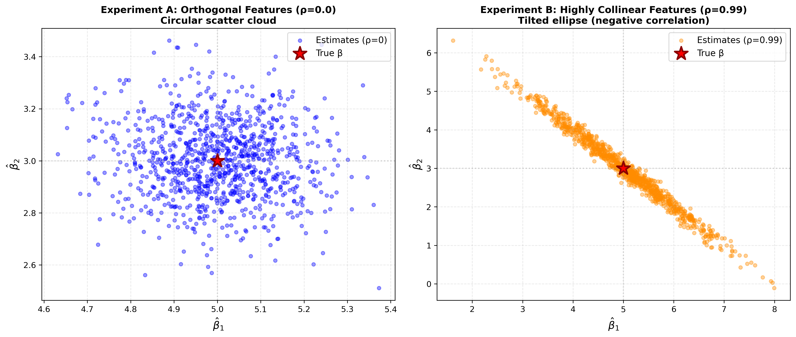

# 实验报告：看见隐形——协方差与多重共线性

## 1. 实验设计与背景 

在本次实验中，我们构建了一个包含两个特征 $X_1$ 和 $X_2$ 的线性回归模型：
$$y = \beta_0 + \beta_1 X_1 + \beta_2 X_2 + \epsilon$$

**设定参数：**
- 真实参数 $\beta = [1.0, 5.0, 3.0]^T$
- 噪声项 $\epsilon \sim N(0, \sigma^2)$，其中 $\sigma = 2.0$
- 样本量 $N = 200$，模拟次数 $M = 1000$

**核心变量：相关系数 $\rho$**
我们通过调整 $X_1$ 和 $X_2$ 之间的相关系数 $\rho$，观察在“特征独立 ($\rho=0.0$)”与“高度共线 ($\rho=0.99$)”两种极端情况下，估计量 $\hat{\beta}$ 的分布变化。

---

## 2. 实验结果：

对于**实验 B (高度共线性 $\rho = 0.99$)**，我们计算并对比了理论公式 $\sigma^2 (X^T X)^{-1}$ 与 1000 次模拟得到的经验协方差矩阵。

### 2.1 协方差矩阵对比（$\beta_1, \beta_2$ 部分）

| 矩阵类型 | 数值结果 |
| :--- | :--- |
| **理论协方差矩阵** | `[[ 0.9679, -0.9621], [-0.9621, 0.9736]]` |
| **经验协方差矩阵** | `[[ 0.9787, -0.9798], [-0.9798, 0.9985]]` |

**结论**：实验结果显示，经验矩阵与理论矩阵高度吻合，验证了 $\text{Var}(\hat{\beta}) = \sigma^2 (X^T X)^{-1}$ 在共线性环境下的准确性。

### 2.2 性能对比摘要

| 指标 | 实验 A ($\rho=0.0$) | 实验 B ($\rho=0.99$) | 变化倍数 |
| :--- | :--- | :--- | :--- |
| **$\text{Var}(\hat{\beta}_1)$** | 0.0159 | 0.9787 | **~61.66x 膨胀** |
| **$\text{Var}(\hat{\beta}_2)$** | 0.0215 | 0.9985 | **~46.51x 膨胀** |
| **$\text{corr}(\hat{\beta}_1, \hat{\beta}_2)$** | -0.0763 (接近 0) | -0.9912 (极强负相关) | - |

---

## 3. 可视化分析

**图表说明**：
- **正交特征（蓝色圆点）**：散点呈现圆形分布，表明 $\hat{\beta}_1$ 和 $\hat{\beta}_2$ 的估计误差是相互独立的，且方差极小，点群紧密聚集在真实值 $(5, 3)$ 周围。
- **共线特征（橙色椭圆）**：散点演变成一个极其狭长的**倾斜椭圆**。这不仅展示了方差的剧烈膨胀（点散布范围变广），还清晰地展示了两个估计量之间极强的负相关性。

---

## 4. 思考题：为什么 $\hat{\beta}_1$ 与 $\hat{\beta}_2$ 呈现强烈的负相关？

### 理论解释：
当 $X_1$ 和 $X_2$ 高度正相关（$\rho = 0.99$）时，它们在解释因变量 $y$ 时提供的信息几乎是重叠的。模型很难区分 $y$ 的变化究竟是由 $X_1$ 引起的还是由 $X_2$ 引起的。

### “总体预算分配”直觉：
我们可以将这个过程理解为**“功劳分配”**：
1. 由于 $X_1 \approx X_2$，模型在拟合时实质上是在处理 $\beta_1 X_1 + \beta_2 X_2 \approx (\beta_1 + \beta_2) X_1$。
2. 对于观测到的 $y$，$X_1$ 和 $X_2$ 的联合贡献（即 $\beta_1 + \beta_2$ 的总和）是相对确定的。
3. 如果蒙特卡洛模拟中的某一次随机噪音导致模型**高估**了 $X_1$ 的贡献（$\hat{\beta}_1$ 偏大），为了保持总和（对 $y$ 的解释）稳定，模型必须相应地**低估** $X_2$ 的贡献（$\hat{\beta}_2$ 偏小）。

这种“此消彼长”的关系在数学上体现为协方差矩阵中的负偏置，在图形上则体现为散点图那条从左上到右下的狭长“斜线”。

---

## 5. 结论
多重共线性并不会导致 OLS 估计量产生偏误（均值仍接近真实值），但它会：
1. **摧毁精度**：使方差膨胀数十倍，导致估计结果极其不可信。
2. **摧毁独立性**：使参数估计量之间产生极强的线性相关性，导致我们无法单独解释单个自变量对因变量的影响。