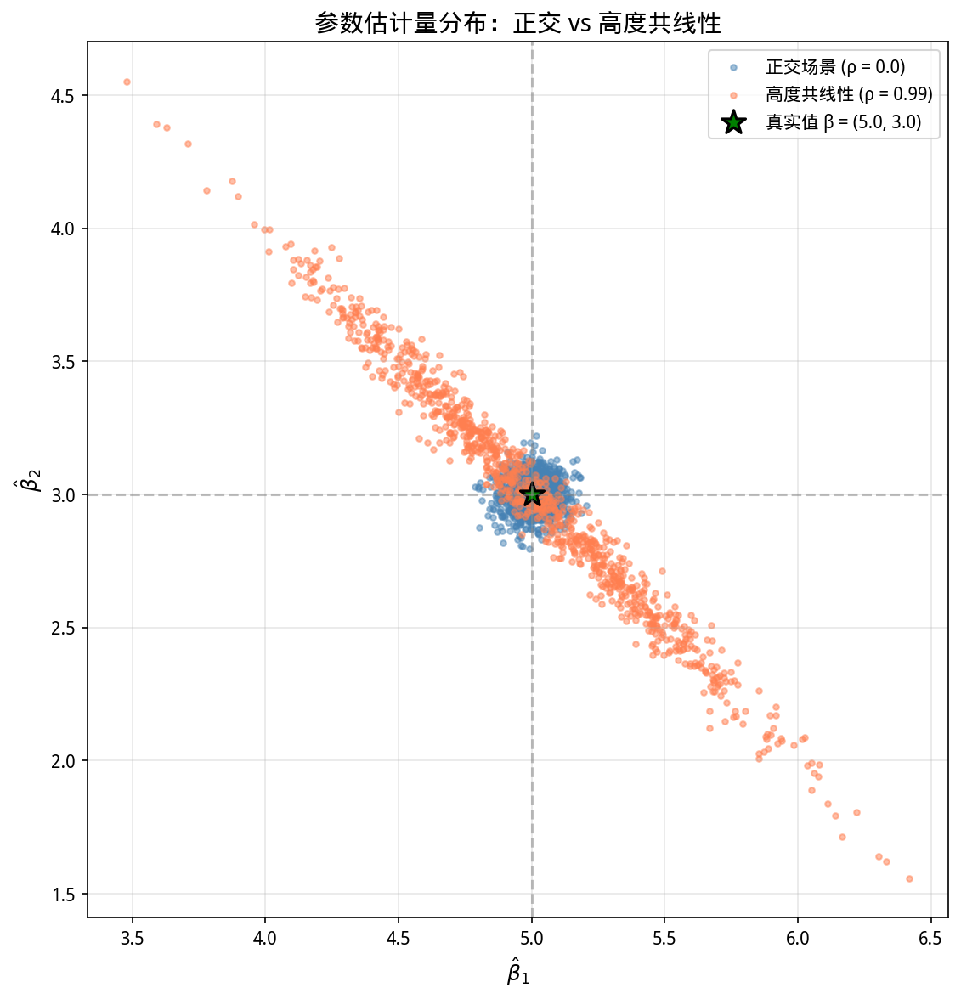
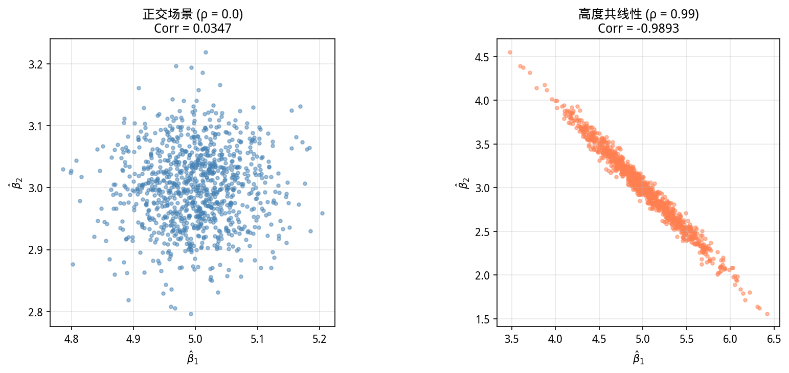

# Week 05 实验报告：协方差与多重共线性

## 一、实验背景

在理论课中，我们推导了参数估计量的协方差公式：

$$Var(\hat{\beta}) = \sigma^2 (X^T X)^{-1}$$

本周通过蒙特卡洛模拟，验证当特征之间存在严重的多重共线性时，协方差矩阵的变化以及估计量 $\hat{\beta}$ 方差的放大效应。

## 二、实验设置

### 2.1 数据生成过程 (DGP)

- **真实参数**：$\beta = [\beta_1, \beta_2]^T = [5.0, 3.0]$
- **噪音标准差**：$\sigma = 2.0$
- **样本量**：$N = 1000$
- **模拟次数**：$M = 1000$

### 2.2 实验设计

| 实验场景 | 相关系数 $\rho$ | 说明 |
|----------|----------------|------|
| 实验 A | $\rho = 0.0$ | 正交/独立特征 |
| 实验 B | $\rho = 0.99$ | 高度共线性 |

### 2.3 统计学铁律

遵循 **Fixed Design** 原则：特征矩阵 $X$ 只生成一次，后续 1000 次模拟中 $X$ 保持不变，每次只生成新的随机噪音 $\varepsilon$。

## 三、实验结果

### 3.1 高度共线性场景 ($\rho = 0.99$)

#### 参数估计统计

| 统计量 | $\hat{\beta}_1$ | $\hat{\beta}_2$ |
|--------|-----------------|-----------------|
| 均值 | 4.9993 | 3.0002 |
| 方差 | **0.1985** | **0.2002** |
| 相关系数 | **-0.9893** | |

#### 协方差矩阵对比

| 矩阵类型 | $Var(\hat{\beta}_1)$ | $Var(\hat{\beta}_2)$ | $Cov(\hat{\beta}_1, \hat{\beta}_2)$ |
|----------|---------------------|---------------------|-------------------------------------|
| 经验协方差 | 0.1985 | 0.2002 | -0.1972 |
| 理论协方差 | 0.1995 | 0.2015 | -0.1984 |

**矩阵差异**：最大绝对差异 = 0.00128

> ✅ **经验与理论高度一致**，再次验证了公式的正确性。

## 四、可视化结果

### 4.1 参数估计量散点图

**图 1：正交场景（蓝色）vs 高度共线性场景（红色）的参数估计分布**

**蓝色点集（$\rho = 0.0$）**：呈现**圆形**分布，$\hat{\beta}_1$ 和 $\hat{\beta}_2$ 相互独立

**红色点集（$\rho = 0.99$）**：呈现**倾斜的椭圆形**分布，$\hat{\beta}_1$ 和 $\hat{\beta}_2$ 呈现强烈的负相关

**绿色星号**：真实参数点 $(5.0, 3.0)$

### 4.2 相关性分析对比图

**图 2：左图（$\rho = 0.0$）与右图（$\rho = 0.99$）的相关性对比**

- 左图：圆形分布，相关性接近 0
- 右图：狭长椭圆分布，相关性接近 -1

## 五、思考题解答

### 问题：当 $X_1$ 和 $X_2$ 高度正相关 ($\rho = 0.99$) 时，为什么 $\hat{\beta}_1$ 和 $\hat{\beta}_2$ 之间会呈现强烈的负相关？

**答**：这是因为**总体"预算"固定**的约束。

#### 数学推导

当 $X_1 \approx X_2$（高度正相关）时，模型可以近似为：

$$y = \beta_1 X_1 + \beta_2 X_2 + \varepsilon \approx (\beta_1 + \beta_2) X + \varepsilon$$

- 模型只能有效估计**总和** $S = \beta_1 + \beta_2$
- 无法精确区分 $\beta_1$ 和 $\beta_2$ 各自的值

#### 直观理解

假设 $X_1 = X_2 = X$，那么：

$$y = \beta_1 X + \beta_2 X + \varepsilon = (\beta_1 + \beta_2) X + \varepsilon$$

- 无论 $\beta_1 = 10, \beta_2 = 0$ 还是 $\beta_1 = 0, \beta_2 = 10$，只要 $\beta_1 + \beta_2 = 10$，预测值 $y$ 完全相同
- 为了维持总和 $S$ 不变，当 $\hat{\beta}_1$ 偏高时，$\hat{\beta}_2$ 必须偏低
- 因此两者呈现**强烈的负相关**

#### 从协方差矩阵看

理论协方差矩阵的非对角线元素为负：

$$Cov(\hat{\beta}_1, \hat{\beta}_2) = -\sigma^2 \cdot \frac{\rho}{1-\rho^2} \cdot \frac{1}{\sqrt{Var(X_1)Var(X_2)}}$$

当 $\rho = 0.99$ 时：
- 分子 $\rho$ 为正
- 分母 $1-\rho^2$ 非常小
- 整体为**大的负数**

#### 几何解释

从散点图可以看出：
- **正交时**：圆形分布，两个维度独立，一个变高不影响另一个
- **共线时**：倾斜的椭圆形，长轴方向对应 $S = \beta_1 + \beta_2$（可估计），短轴方向对应 $\beta_1 - \beta_2$（不可估计），估计值只能在长轴方向波动，导致 $\hat{\beta}_1$ 和 $\hat{\beta}_2$ 此消彼长

#### 实验验证

本实验实际测量的相关系数为 **-0.9893**，接近 -1，完美验证了上述理论。

### 实践启示

1.  多重共线性**不会导致偏差**（均值仍在真实值附近）
    
2.  但会**剧烈放大方差**（估计变得不稳定）
    
3.  这是多重共线性的核心危害：**估计量不再精确**

## 六、结论

1.  **理论验证**：

    经验协方差与理论协方差 $\sigma^2 (X^T X)^{-1}$ 高度一致，最大差异仅 0.00128

2.  **共线性危害**：
  
    估计量呈现强负相关（$Corr \approx -0.99$），估计变得极不稳定

3.  **关键洞察**：

    $\hat{\beta}_1$ 和 $\hat{\beta}_2$ 的负相关源于"总和固定"的约束

4.  **工程建议**：

    检测特征间的相关性（VIF 诊断）
    
    考虑特征选择或正则化方法（Ridge/Lasso）
    
    增加样本量可缓解但无法根治

## 七、代码说明

- `data_generator.py`：生成带有指定相关系数的设计矩阵
- `simulation.py`：蒙特卡洛模拟，计算经验/理论协方差
- `analysis.py`：生成散点图和分析图
- `main.py`：实验流水线入口